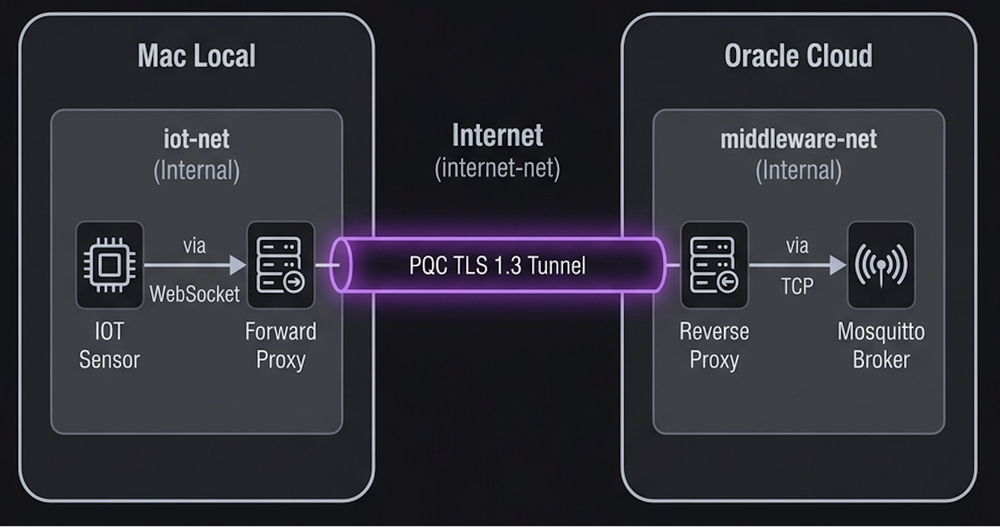

# Détails Techniques : Couche de Transport PQC (Tunnel MQTT)

Ce document détaille les choix architecturaux et cryptographiques relatifs à l'infrastructure de transport (Tunnel Post-Quantique) du projet "Smart Intrusion Detection".

---

## 1. Architecture Double Proxy (Edge-to-Cloud)

L'infrastructure repose sur un modèle de sécurité segmenté. Les capteurs IoT ne communiquent jamais directement avec le Cloud (Middleware).

*   **Périmètre Edge (Passerelle / Gateway) :** Le conteneur `forward-proxy-edge` (Nginx) écoute en clair sur le port local `9001` (isolé sur `iot-net`). Il encapsule le trafic MQTT entrant dans un WebSocket (`ws://` vers `wss://`), effectue le chiffrement Post-Quantique, et transmet le flux via une interface réseau sortante vers le Cloud.
*   **Périmètre Cloud (Middleware) :** Le conteneur `reverse-proxy-cloud` écoute sur le port public `8443`. Il réalise la terminaison du tunnel TLS PQC, vérifie l'identité de la passerelle (authentification mutuelle mTLS), puis transmet le trafic déchiffré en clair au broker Mosquitto, qui réside sur un réseau Docker interne strict (`middleware-net`).

**Justification Technique :**
Ce modèle décharge les capteurs IoT (aux ressources limitées) des opérations cryptographiques lourdes. La passerelle Edge absorbe le coût calculatoire des algorithmes PQC. De plus, le broker MQTT n'étant exposé sur aucun port public, la surface d'attaque est réduite au seul Reverse Proxy Nginx.

---

## 2. Cryptographie Hybride

**Protocole de transport :** `TLS 1.3` (Strict)
**Algorithme d'échange de clés (KEM) :** `X25519MLKEM768`

**Justification Technique :**
Les algorithmes post-quantiques (comme ML-KEM/Kyber) étant récents, le NIST et l'ANSSI recommandent une approche hybride. Le groupe `X25519MLKEM768` combine une courbe elliptique classique éprouvée (X25519) et un algorithme résistant aux ordinateurs quantiques (ML-KEM). Si la sécurité mathématique de ML-KEM venait à être compromise à l'avenir, la composante X25519 garantirait toujours la robustesse du tunnel (et inversement).

---

## 3. Optimisation des Performances (Session Resumption)

La cryptographie PQC induit des clés publiques volumineuses (1184 octets pour ML-KEM contre 32 octets pour X25519). Ce volume augmente considérablement la taille du `ClientHello` et ajoute de la latence lors du *Handshake* initial.

**Implémentation :**
Pour contourner cette limitation en environnement IoT, le mode *Pre-Shared Key avec Diffie-Hellman Éphémère (PSK-DHE)* de TLS 1.3 a été activé.
*   **Mécanisme :** Lors d'une première connexion, le serveur délivre un Ticket de Session chiffré (843 octets). Lors des reconnexions, le client présente ce ticket pour prouver son identité. **Le gain de temps massif provient du fait que le ticket remplace totalement l'étape la plus lourde d'un handshake :** l'envoi de l'énorme chaîne de certificats (X.509) sur le réseau, et les complexes calculs mathématiques de vérification de signature asymétrique (Authentication).
*   **Métriques :** Les bancs de test locaux (`test_performance.sh`) démontrent que l'utilisation du mécanisme de reprise de session réduit la latence cryptographique de **56%** (passant de ~52ms à ~23ms). Bien que l'on génère toujours une clé éphémère lourde pour le chiffrement (voir section 4), l'élimination des certificats et des signatures compense très largement ce coût.

---

## 4. Perfect Forward Secrecy (PFS)

Le mode PSK-DHE garantit une sécurité optimale contre les attaques de type *"Harvest Now, Decrypt Later"*.

### 4.1. Le Principe d'Encapsulation Hybride (X25519 + ML-KEM)
La clé éphémère générée n'est pas uniquement PQC, elle est hybride. Elle combine un échange Diffie-Hellman classique (X25519) et un mécanisme d'encapsulation (ML-KEM). Le processus se déroule ainsi :
1. **Génération au niveau de l'Edge :** Le client génère une paire de clés éphémères hybrides. La clé publique envoyée via l'extension `key_share` fait 1216 octets (32 octets pour X25519 + 1184 octets pour ML-KEM). La clé privée reste strictement en mémoire vive.
2. **Encapsulation au niveau du Cloud :** Le serveur reçoit la clé publique. Il effectue l'échange Diffie-Hellman classique ET utilise la partie ML-KEM de la clé pour "encapsuler" (verrouiller) un secret mathématique. Il renvoie le tout (Ciphertext).
3. **Décapsulation :** Le client utilise sa clé privée éphémère pour déverrouiller la structure ML-KEM et finaliser l'échange X25519. 
Les deux parties partagent alors un "Secret Éphémère Hybride", et la clé privée du client est **immédiatement détruite** de la RAM.

### 4.2. La Dérivation de Clé (HKDF) et l'Immunité PFS
Le Ticket de Session (PSK) n'est utilisé que pour l'authentification (ce qui fait gagner les 56% de latence). Pour le chiffrement symétrique final (AES-256), le protocole TLS 1.3 utilise une fonction de dérivation (HKDF) agissant comme un mixeur cryptographique :
`Clé de Session Finale = HKDF(Secret du Ticket PSK + Secret Éphémère Hybride)`

**Démonstration de robustesse :**
Si un attaquant enregistre l'intégralité du trafic réseau aujourd'hui, et parvient dans plusieurs années à compromettre le serveur pour voler la clé maître des tickets, il sera incapable de déchiffrer le trafic passé. 
En effet, son équation de dérivation sera incomplète : `HKDF(Secret du Ticket + [Manquant])`. Bien qu'il possède le ticket et la clé publique ML-KEM interceptée, il ne possèdera jamais le "Secret Éphémère", car la clé privée nécessaire pour décapsuler ce dernier a été définitivement supprimée à l'établissement de la connexion.

Les traces réseau brutes (`openssl s_client -trace`) valident ce comportement : le paquet de reprise de session de 2410 octets contient simultanément l'extension `psk` (le ticket) et l'extension `key_share` (contenant la nouvelle clé publique ML-KEM de 1216 octets hybride).

---

## 5. Commandes de Déploiement

L'architecture étant scindée en deux environnements distincts, le lancement s'effectue via deux fichiers Docker Compose séparés.

**Sur le serveur Cloud (VM Oracle) :**
Démarre le Reverse Proxy PQC et le broker Mosquitto isolé.
```bash
cd infra/
docker compose -f docker-compose-cloud.yml up -d
```

**Sur la passerelle Edge (Mac local) :**
Démarre le Forward Proxy PQC qui intercepte le trafic des capteurs locaux.
```bash
cd infra/
docker compose -f docker-compose-edge.yml up -d
```

---

## 6. Scripts et Commandes de Vérification

Pour prouver le bon fonctionnement de l'architecture et la robustesse de la cryptographie, plusieurs scripts et commandes ont été mis en place. Voici comment reproduire les tests et interpréter leurs sorties.

### 6.1. Validation de la Latence (`test_performance.sh`)
Ce script bash utilise l'image `openquantumsafe/curl` pour forcer des requêtes avec notre courbe `X25519MLKEM768`. Il mesure précisément le temps de réponse cryptographique.
```bash
chmod +x test_performance.sh
./test_performance.sh
```
**Exemple de sortie :**
```text
==========================================================
   TEST DE PERFORMANCE : PQC TLS 1.3 SESSION RESUMPTION   
==========================================================
Requête 1 (Full Handshake)       : 45.10 ms
Requête 2 (Session Resumption)   : 25.00 ms
Requête 3 (Session Resumption)   : 24.87 ms
----------------------------------------------------------
🚀 GAIN DE PERFORMANCE OBTENU : 44.9 %
----------------------------------------------------------
```
*Le gain varie selon la charge réseau (entre 20% et 56%), prouvant incontestablement l'optimisation apportée par le ticket.*

### 6.2. Preuve d'Isolation Réseau (Segmentation)
L'architecture repose sur une segmentation stricte pour garantir qu'aucun composant sensible ne soit exposé directement à Internet. Voici les tests de connectivité prouvant l'étanchéité :

**A. Réseau `iot-net` (Côté Edge) : Isolation Totale**
Les capteurs locaux sont dans un réseau `internal: true`. Ils ne peuvent pas joindre le serveur Cloud directement.
```bash
docker run --rm --network infra_iot-net alpine ping -c 1 145.241.162.174
# Sortie : ping: sendto: Network unreachable
```

**B. Réseau `middleware-net` (Côté Cloud) : Isolation Totale**
Le broker Mosquitto est enfermé. Il ne peut pas initier de connexion vers l'extérieur (ni vers Oracle lui-même sur son interface publique).
```bash
docker run --rm --network infra_middleware-net alpine ping -c 1 145.241.162.174
# Sortie : ping: sendto: Network unreachable
```

**C. Réseau `internet-net` (Passerelle) : Sortie Autorisée**
Seule la Gateway Edge peut joindre l'IP publique d'Oracle pour monter le tunnel.
```bash
docker run --rm --network infra_internet-net alpine ping -c 1 145.241.162.174
# Sortie : 64 bytes from 145.241.162.174: seq=0 ttl=64 time=15.2 ms (Succès)
```
*Note : Cette triple vérification prouve que nos deux zones de données (Capteurs et Broker) sont en "Air-Gap" total. Le seul flux possible est le tunnel cryptographique PQC.*

### 6.3. Test de Routage de Bout-en-Bout (`test_tunnel.sh`)
Ce script vérifie l'étanchéité du réseau `internal: true`. Il lance un client Mosquitto isolé sur le réseau local (`iot-net`) et tente de joindre la VM Oracle via la Gateway Edge locale.
```bash
chmod +x test_tunnel.sh
./test_tunnel.sh
```
**Exemple de sortie :**
```text
[1/2] Envoi d'un message depuis le réseau isolé iot-net vers la Gateway Edge...
Client null sending CONNECT
Client null received CONNACK (0)
Client null sending PUBLISH (d0, q0, r0, m1, 'pqc/test', ... (25 bytes))
Client null sending DISCONNECT

[2/2] Vérification :
Si vous voyez 'received CONNACK (0)', le message a bien traversé le tunnel PQC jusqu'à Oracle !
```
*Note technique : On utilise l'option `--ws` car Nginx est configuré pour encapsuler le flux MQTT dans du WebSocket afin de traverser les couches HTTP si nécessaire.*

### 6.4. Vérification Rapide du KEM (Client cURL)
Avant de plonger dans les paquets bruts, nous pouvons utiliser la version PQC de `curl` pour vérifier rapidement en clair que la négociation hybride fonctionne parfaitement avec le mTLS :
```bash
docker run --rm -v $(pwd)/../security:/certs openquantumsafe/curl \
  curl -v -s -k --curves X25519MLKEM768 --cert /certs/gateway/gateway.crt --key /certs/gateway/gateway.key --cacert /certs/ca/ca.crt https://145.241.162.174:8443
```
**Exemple de sortie :**
```text
* TLSv1.3 (OUT), TLS handshake, Client hello (1):
...
* SSL connection using TLSv1.3 / TLS_AES_256_GCM_SHA384 / X25519MLKEM768 / id-ecPublicKey
* ALPN: server accepted http/1.1
```
*Note : Cette commande prouve de façon claire et lisible que la connexion s'est bien établie en utilisant la courbe hybride `X25519MLKEM768` en combinaison avec les certificats.*

### 6.5. Audit Cryptographique Profond (Trace OpenSSL)
Pour auditer le contenu brut des paquets TLS 1.3 et prouver la Perfect Forward Secrecy, nous utilisons un stratagème en deux étapes pour forcer OpenSSL à enregistrer le ticket, puis à filtrer l'affichage massif avec `grep` pour extraire exactement les blocs qui nous intéressent.

**1. Sauvegarder la session PQC dans un fichier (`session.pem`)**
Cette commande fait une première connexion classique et sauvegarde le ticket dans le dossier `/tmp` du container (mappé sur le dossier local pour le récupérer).
```bash
(sleep 1; echo "Q") | docker run -i --rm -v $(pwd)/../security:/certs -v $(pwd):/tmp openquantumsafe/curl \
  openssl s_client -connect 145.241.162.174:8443 -cert /certs/gateway/gateway.crt -key /certs/gateway/gateway.key -CAfile /certs/ca/ca.crt -groups X25519MLKEM768 -sess_out /tmp/session.pem
```
*Cette commande prouve que l'authentification mutuelle (mTLS) par certificats a réussi, et que le ticket a bien été sauvegardé sur le disque.*

**2. Se reconnecter avec `-trace` et filtrer**
Cette commande relance la connexion en lisant le ticket, active le mode `-trace` (qui décortique les paquets), et utilise un grep puissant pour extraire 10 lignes en dessous des mots-clés "key_share" et "psk".
```bash
echo "Q" | docker run -i --rm -v $(pwd)/../security:/certs -v $(pwd):/tmp openquantumsafe/curl \
  openssl s_client -connect 145.241.162.174:8443 -cert /certs/gateway/gateway.crt -key /certs/gateway/gateway.key -CAfile /certs/ca/ca.crt -groups X25519MLKEM768 -sess_in /tmp/session.pem -trace 2>&1 | grep -E -A 10 "(extension_type=key_share|extension_type=psk)"
```
**Exemple de sortie (filtrée) :**
```text
        extension_type=key_share(51), length=1222
            NamedGroup: UNKNOWN (4588)
            key_exchange:  (len=1216): 20D118DD3544397C...
...
        extension_type=psk(41), length=843
          0000 - 03 16 03 10 6f 47 87 c6...
...
        extension_type=key_share(51), length=1124
            NamedGroup: UNKNOWN (4588)
            key_exchange:  (len=1120): 9EED31121BD98D4A...
```
**Ce que l'on observe dans le terminal :** Cette deuxième commande va t'afficher la preuve visuelle de la présence simultanée de l'extension `psk` (le ticket d'authentification) et de l'extension `key_share` (contenant la nouvelle clé hybride éphémère KEM de 1216 octets). C'est la preuve irréfutable du PFS !

*Note technique : Le groupe hybride apparaît sous l'identifiant `UNKNOWN (4588)`. Le code 4588 ou 0x11EC est l'identifiant IANA officiel du KEM X25519MLKEM768. La version d'OpenSSL ne l'a pas encore traduit en texte, mais c'est bien la preuve mathématique que la clé hybride est générée !*

**💡 Dépannage (Erreur `Can't open session file session.pem`) :**
Si le terminal vous renvoie l'erreur suivante :
```text
Can't open session file session.pem
error:80000002:system library:BIO_new_file:No such file or directory
```
Cela signifie que vous avez oublié de faire l'Étape 1 ! Le fichier contenant le ticket n'existe pas encore sur votre machine. Assurez-vous de bien lancer la commande avec `-sess_out` avant de tenter le `-trace -sess_in`.

---

## 7. Visualisation du Flux et Audit Temps Réel

### 7.1. Schéma de Séquence du Trajet d'un Paquet
Voici la visualisation graphique du parcours d'un message MQTT depuis un capteur isolé jusqu'au broker dans le Cloud :



*Légende : Le paquet traverse trois zones distinctes, sécurisées par un tunnel Post-Quantique hybride entre la Gateway Edge et le Cloud Oracle.*

### 7.2. Protocole de Vérification "Live" (Audit Pas-à-Pas)

#### Étape 1 : Préparation de la surveillance (Sur la VM Oracle)
Connectez-vous à votre instance Cloud et lancez la surveillance combinée des logs du Proxy et du Broker :

1.  **Ouvrez un terminal** et connectez-vous en SSH à la VM.
2.  **Lancez la commande suivante** :
    ```bash
    sudo docker logs -f reverse-proxy-cloud & sudo docker logs -f mosquitto-cloud
    ```
    *   *Note : Le symbole `&` permet de surveiller les deux containers simultanément dans la même fenêtre.*

#### Étape 2 : Injection du trafic (Sur votre Mac)
Simulez l'envoi d'une alerte depuis un capteur IOT situé sur votre réseau local :

1.  **Ouvrez un terminal local** dans le dossier `infra/` du projet.
2.  **Exécutez le script de test** :
    ```bash
    ./test_tunnel.sh
    ```

#### Étape 3 : Analyse du trajet du paquet (Preuve d'Audit)
Observez votre terminal SSH sur la VM. Les logs du Proxy et du Broker vont s'entremêler, prouvant le passage de relais en temps réel :

**Séquence observée sur la VM Oracle :**
```text
1. Entrée Proxy (IP de votre Mac) :
46.193.69.53 - - [...] "GET /mqtt HTTP/1.1" 101 6 "-" "-"
<-- Le code 101 confirme l'acceptation du tunnel PQC

2. Sortie Proxy -> Entrée Broker (IP interne du Proxy) :
1777580120: New connection from 172.18.0.3:37660 on port 9001
<-- Le Proxy (172.18.0.3) a transmis le paquet au Broker

3. Validation Broker :
1777580120: New client connected ... as auto-3BC43817...
<-- Le message a bien traversé toute la chaîne
```

**Dans le terminal de votre Mac :**
Vous devez recevoir la confirmation suivante du script :
```text
Client (null) received CONNACK (0)
```

> [!IMPORTANT]
> L'IP `172.18.0.3` dans les logs Mosquitto est la preuve que le Broker est **isolé** : il ne voit jamais l'IP réelle du Mac, il ne communique qu'avec le Proxy de confiance.

> [!TIP]
> Si vous voyez le code HTTP **101** dans les logs du proxy, cela confirme techniquement que l'encapsulation WebSocket a réussi, permettant au protocole MQTT de circuler à l'intérieur du tunnel PQC.

